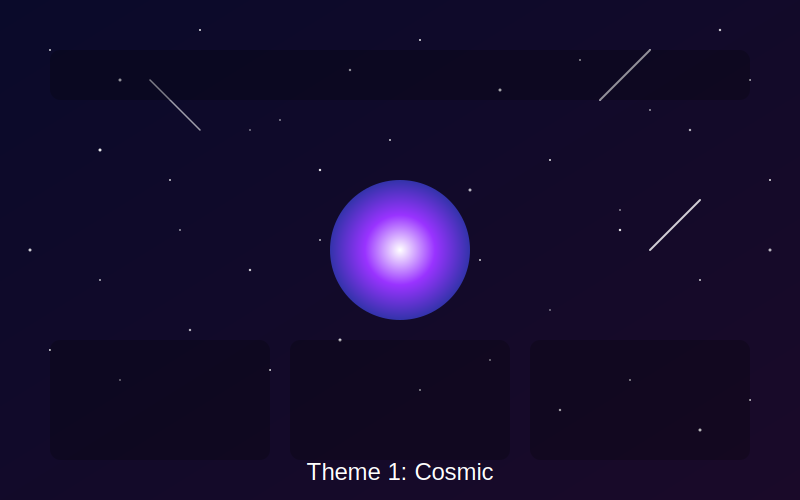

# Mashaaer Feelings Theme Documentation

This document provides comprehensive details on the available themes in Mashaaer Feelings, including their design principles, usage guidelines, and technical implementations.

## Available Themes

### Theme 1: Cosmic

**Description**: 
The Cosmic theme creates an immersive space environment with a dynamic meteor shower background. It features a central glowing purple orb as the primary interaction point. The design emphasizes depth and motion with flowing meteors and ambient cosmic effects.

**Key Features**:
- Dynamic meteor shower animation
- Glowing purple orb as central interaction element
- Deep space color palette (purples, blues, blacks)
- Ambient cosmic audio effects
- Responsive design that adapts to all screen sizes

**Technical Implementation**:
- CSS: `static/css/cosmic-theme.css`
- JavaScript: `static/js/meteor-shower.js`
- Audio: `static/audio/cosmic_ambient.mp3`

**Usage Guidelines**:
- Best displayed on darker screens for maximum visibility of effects
- Works optimally with WebGL-enabled browsers for smooth animations
- Requires minimal CPU/GPU resources despite the rich visual effects

### Theme 2: Falling Stars

**Description**:
The Falling Stars theme offers a serene night sky experience with stars that gently fall across the screen. It maintains the central orb interaction pattern from Theme 1 but with a softer, more meditative aesthetic and different animation patterns.

**Key Features**:
- Falling stars animation with gentle movements
- Star trail effects from interactive elements
- Occasional shooting stars for visual interest
- Nebula cloud effects for depth
- Calm, soothing visual experience

**Technical Implementation**:
- CSS: `static/css/falling-stars-theme.css`
- JavaScript: `static/js/falling-stars.js`
- Utilizes dynamic star generation for uniqueness

**Usage Guidelines**:
- Creates a calmer user experience compared to the Cosmic theme
- Suitable for extended use with reduced visual intensity
- Still maintains the core interaction model for consistency

## Theme Management

### User Selection

Users can select their preferred theme via:
1. The themes showcase page (`/themes`)
2. The user settings page (`/user/settings`)
3. Directly from the application menu

### How Themes Are Applied

1. When a user selects a theme, it's stored in the database using the setting name `theme`
2. The selection is applied immediately and persists across sessions
3. Themes are loaded by linking the appropriate CSS and JavaScript files
4. A user's theme preference is respected across all pages of the application

### Default Theme

Theme 1 (Cosmic) is the default theme for Mashaaer Feelings, establishing the signature visual identity of the application.

## Extending the Theme System

### Adding New Themes

To add a new theme to Mashaaer Feelings:

1. Create theme CSS file in `static/css/[theme-name]-theme.css`
2. Create animation JavaScript in `static/js/[theme-name].js`
3. Add theme preview image in `static/images/[theme-name]-preview.svg` (or .jpg/.png)
4. Update the themes array in the `themes_showcase()` function in `main.py`
5. Add the new theme ID to the `valid_themes` list in the `set_theme()` function

### Theme Design Principles

When creating or extending themes, follow these principles:

1. **Consistency**: Maintain the central orb as the primary interaction point
2. **Performance**: Optimize animations for performance on all devices
3. **Accessibility**: Ensure text remains readable against the animated background
4. **Responsiveness**: Design must work across all screen sizes
5. **Branding**: Incorporate Mashaaer branding colors (purples, blues)